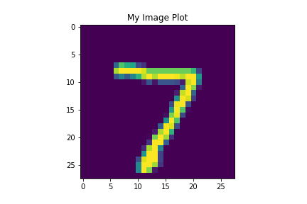

# Formal_Response_Week_2

### A. In the video, First steps in computer vision, Laurence Maroney introduces us to the Fashion MNIST data set and using it to train a neural network in order to teach a computer “how to see.” One of the first steps towards this goal is splitting the data into two groups, a set of training images and training labels and then also a set of test images and test labels. Why is this done? What is the purpose of splitting the data into a training set and a test set?

For the training set the data is split like this because we need to teach/train the neural network how to respond to the particular inputs that we are trying to have it classify. For the test set the we use this to determine the external validity of our model ie how well it performs on data it has not seen. The test set helps us see if our model would be useful if we applied to real world uses.

### B. The fashion MNIST example has increased the number of layers in our neural network from 1 in the past example, now to 3. The last two are .Dense layers that have activation arguments using the relu and softmax functions. What is the purpose of each of these functions. Also, why are there 10 neurons in the third and last layer in the neural network.

The relu function takes the output of a neuron if it is less than 0 and just sets it to 0. This is done because negative values can adversely affect the model.
The softmax function takes the highest probability generated by the model and sets it to 1, while setting the others to 0. This is done so we don't have write to code to find the highest probability among the labels. 
There are 10 neurons because there are 10 labels, one for each type of clothing.

### C. In the past example we used the optimizer and loss function, while in this one we are using the function adam in the optimizer argument and sparse_categorical- crossentropy for the loss argument. How do the optimizer and loss functions operate to produce model parameters (estimates) within the model.compile() function?

The neural network does not know the true relationship between the features and the targets so it has to make guesses and the loss function relays how accurate/inaccurate those guesses are.

### D. Using the mnist drawings dataset (the dataset with the hand written numbers with corresponding labels) answer the following questions.

### 1. What is the shape of the images training set (how many and the dimension of each)?
There are 60000 training images and each image is a 28 pixel by 28 pixel image.

### 2. What is the length of the labels training set?
There are 60000 labels in the labels training set.

### 3. What is the shape of the images test set?
There are 10000 test images and again each image is a 28 pixel by 28 pixel image.

### Estimate a probability model and apply it to the test set in order to produce the array of probabilities that a randomly selected image is each of the possible numeric outcomes (look towards the end of the basic image classification exercises for how to do this — you can apply the same method applied to the Fashion MNIST dataset but now apply it to the hand written letters MNIST dataset). Use np.argmax() with your predictions object to return the numeral with the highest probability from the test labels dataset. Produce a plot of your selected image and the accompanying histogram that illustrates the probability of that image being the selected number

